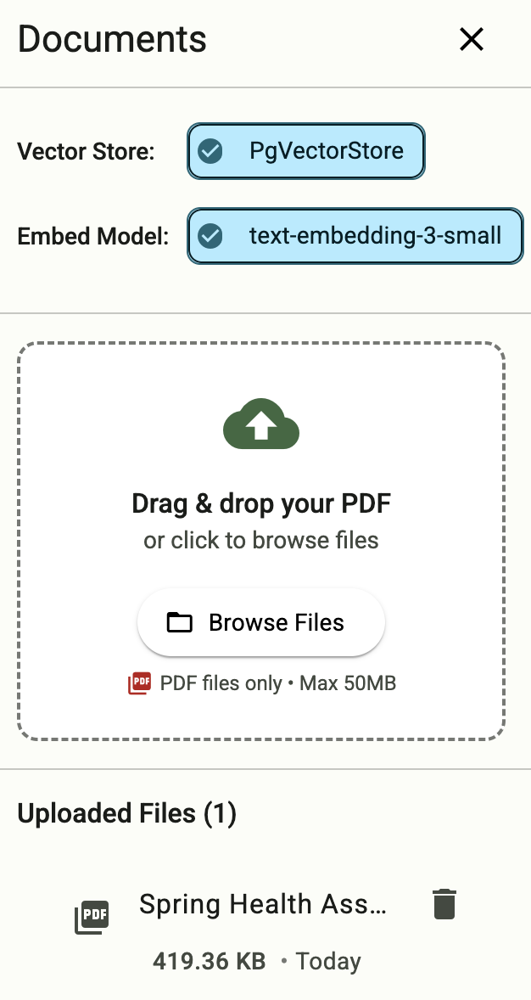

# Tanzu Platform Chat: AI Chat Client for Cloud Foundry

## Overview

Tanzu Platform Chat (cf-mcp-client) is a Spring chatbot application that can be deployed to Cloud Foundry and consume platform AI services. It's built with Spring AI and works with LLMs, Vector Databases, and Model Context Protocol Agents.

## Prerequisites

- Java 21 or higher
  - e.g. using [sdkman](https://sdkman.io/) `sdk install java 21.0.7-oracle`
- Maven 3.8+
  - e.g. using [sdkman](https://sdkman.io/) `sdk install maven`
- Access to a Cloud Foundry Foundation with the GenAI tile or other LLM services
- Developer access to your Cloud Foundry environment

## Deploying to Cloud Foundry

### Preparing the Application

1. Create a directory for the application and navigate to it:

```bash
mkdir tanzu-platform-chat
cd tanzu-platform-chat
```

2. Download the latest JAR file and manifest.yml from the [Releases page](https://github.com/cpage-pivotal/cf-mcp-client/releases) into this directory

3. Push the application to Cloud Foundry from the directory containing the downloaded files:

```bash
cf push
```

### Binding to Large Language Models (LLM's)

1. Create a service instance that provides chat LLM capabilities:

```bash
cf create-service genai [plan-name] chat-llm
```

2. Bind the service to your application:

```bash
cf bind-service ai-tool-chat chat-llm
```

3. Restart your application to apply the binding:

```bash
cf restart ai-tool-chat
```

Now your chatbot will use the LLM to respond to chat requests.


### Binding to Vector Databases

1. Create a service instance that provides embedding LLM capabilities

```bash
cf create-service genai [plan-name] embeddings-llm 
```

2. Create a Postgres service instance to use as a vector database

```bash
cf create-service postgres on-demand-postgres-db vector-db
```

3. Bind the services to your application

```bash
cf bind-service ai-tool-chat embeddings-llm 
cf bind-service ai-tool-chat vector-db
```

4. Restart your application to apply the binding:

```bash
cf restart ai-tool-chat
```

5. Click on the document tool on the right-side of the screen, and upload a .PDF File
<p>  </p>

Now your chatbot will respond to queries about the uploaded document


### Binding to MCP Agents

Model Context Protocol (MCP) servers are lightweight programs that expose specific capabilities to AI models through a standardized interface. These servers act as bridges between LLMs and external tools, data sources, or services, allowing your AI application to perform actions like searching databases, accessing files, or calling external APIs without complex custom integrations.

#### SSE Protocol (Server-Sent Events)

1. Create a user-provided service for an SSE-based MCP server using the `mcpSseURL` tag:

```bash
cf cups mcp-server-sse -p '{"uri":"https://your-sse-mcp-server.example.com"}' -t "mcpSseURL"
```

2. Bind the MCP service to your application:

```bash
cf bind-service ai-tool-chat mcp-server-sse
```

#### Streamable HTTP Protocol

1. Create a user-provided service for a Streamable HTTP-based MCP server using the `mcpStreamableURL` tag:

```bash
cf cups mcp-server-streamable -p '{"uri":"https://your-streamable-mcp-server.example.com"}' -t "mcpStreamableURL"
```

2. Bind the MCP service to your application:

```bash
cf bind-service ai-tool-chat mcp-server-streamable
```

#### Complete the Setup

3. Restart your application to apply the bindings:

```bash
cf restart ai-tool-chat
```

Your chatbot will now register with the MCP agents, and the LLM will be able to invoke the agents' capabilities when responding to chat requests. The application supports both SSE and Streamable HTTP protocols simultaneously.


### Binding to A2A Agents

Agent2Agent (A2A) is a protocol that enables communication between independent AI agent systems. Unlike MCP servers which provide tools that your LLM can invoke, A2A agents are independent AI systems that can process messages and return their own intelligent responses. Think of MCP as giving your chatbot tools to use, while A2A lets your chatbot consult with other specialized AI agents.

#### Key Differences: MCP vs A2A

- **MCP Servers**: Provide tools and data sources that your LLM invokes as part of generating a response
- **A2A Agents**: Independent AI agents that you can send messages to directly and receive complete responses from

#### Binding an A2A Agent

1. Create a user-provided service for an A2A agent using the `a2a` tag:

```bash
cf cups a2a-agent -p '{"uri":"https://your-a2a-agent.example.com/.well-known/agent.json"}' -t "a2a"
```

The URI should point to the agent's Agent Card (a JSON descriptor at `/.well-known/agent.json`).

2. Bind the A2A service to your application:

```bash
cf bind-service ai-tool-chat a2a-agent
```

3. Restart your application to apply the binding:

```bash
cf restart ai-tool-chat
```

#### Using A2A Agents

After binding A2A agents:

1. Click the **Agents** button (🤖) on the navigation rail
2. The Agents panel shows all connected A2A agents with their:
   - Name, description, and version
   - Health status (healthy/unhealthy)
   - Capabilities (streaming, push notifications, state history)
3. Click "Send Message" on any healthy agent
4. Type your message in the dialog and click "Send"
5. The agent's response appears in the chat with a distinct visual style

Agent messages are displayed with:
- A robot icon (🤖) and agent name header
- Tertiary color scheme (different from your LLM's responses)
- Clear attribution showing which agent responded

You can bind multiple A2A agents simultaneously, each providing specialized capabilities. The Agents panel displays health status for each agent, and the navigation button shows a status indicator (green/orange/red) based on overall agent health.

### Using a Vector Store for Conversation Memory

If you are bound to a vector database and an embedding model, then your chat memory will persist across application restarts and scaling.


1. Follow the instructions above in [Binding to Vector Databases](#binding-to-vector-databases)


## Disclaimer
This repository is an unofficial project provided “as is.” It is not supported or endorsed by any organization, and no warranty or guarantee of functionality is provided. Use at your own discretion.
